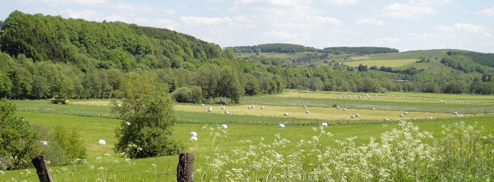

VSSP '18 is a [GI-Dagstuhl seminar for young researchers](https://www.dagstuhl.de/en/program/gi-dagstuhl-seminars/) that addresses the problem of visualizing performance-related data of systems and the software that they run. Due to the scale of performance-related data and the open-ended nature of analyzing it, visualization is often the only feasible way to comprehend, improve, and debug the performance behavior of systems. The rise of cloud and big data systems, and the rapidly growing scale of the performance-related data that they generate, have led to an increased need for visualization of such data. However, the research communities behind data visualization, performance engineering, and high-performance computing are largely disjunct. The goal of this seminar is to bring together young researchers from these research areas to identify cross-community collaboration and to set the path for long-lasting collaborations towards rich and effective visualizations of performance-related data.

The main goal of the VSSP '18 is to bring together young researchers (PhD students, postdocs, and assistant professors) in the areas of (i) performance engineers, (ii) software visualization, and (iii) high-performance computing. The seminar has the following objectives:
- The seminar shall provide a joint forum for participants coming from different, mostly disconnected research communities.
- The participants shall learn about the latest developments in their own as well as adjacent research areas.
- The seminar shall foster interaction among the participants and establish collaborations between the researchers towards joint research projects.

VSSP '18 will take place from July 9 until July 13 (Mon - Fri), 2018, in Dagstuhl, Germany. [Schloss Dagstuhl – Leibniz Center for Informatics](http://www.dagstuhl.de/en/about-dagstuhl/) is a castle situated at the scenic countryside of Saarland. It is a world-renowned meeting place for computer scientists. We are honored to be hosted by Schloss Dagstuhl and supported to bring together young researchers from different disciplines. The seminar is sponsored by the [GI](https://www.gi.de/) and Schloss Dagstuhl - participants pay only 50 EUR per night for accomodation/full board. VSSP '18 is officially listed on the Dagstuhl [website](http://www.dagstuhl.de/no_cache/en/program/calendar/evhp/?semnr=18283).

&nbsp;&nbsp;&nbsp;

# Organizers
- [Fabian Beck](https://www.vis.wiwi.uni-due.de/en/team/fabian-beck/) (Universität Duisburg–Essen - Essen, DE)
- [Alexandre Bergel](http://bergel.eu) (University of Chile – Santiago de Chile, CL)
- [Cor-Paul Bezemer](http://sailhome.cs.queensu.ca/~corpaul/) (Queen's University – Kingston, CA)
- [Katherine E. Isaacs](http://hdc.cs.arizona.edu/people/kisaacs/) (University of Arizona – Tucson, US)
 
# Call for applications

*Our call for applications is now [closed](call.md)!*
 
# Participants

Davide Arcelli (University of L'Aquila, Italy)  
Fabian Beck	(University of Duisburg-Essen, Germany)  
Alexandre Bergel (University of Chile, Chile)  
Cor-Paul Bezemer (University of Alberta, Canada)  
Abhinav Bhatele (Lawrence Livermore National Laboratory, US)  
David Boehme (Lawrence Livermore National Laboratory, US)  
Jinfu Chen (Concordia University, Canada)  
Diego Costa	(Heidelberg University, Germany)  
Sarah Goodwin (Monash University, Australia)  
Patrick Gralka (University of Stuttgart, Germany)  
Kevin Griffin (LLNL/University of California, US)  
Marc-Andre Hermanns	(Jlich Supercomputing Centre, Germany)  
Katherine Isaacs (University of Arizona, US)  
Angelina Lee (Washington University, US)  
Philipp Leitner	(Chalmers, Sweden)  
Xu Liu	Xu (William & Mary, US)  
Leonel Merino (University of Bern, Switzerland)  
Oliver Moseler (University of Trier, Germany)  
Chris Muelder (University of California, Davis, US / Google)  
Dusan Okanovic (University of Stuttgart, Germany)  
Olga Pearce	(Lawrence Livermore National Laboratory, US)  
Paul Rosen	(University of South Florida, US)  
Juan Pablo Sandoval (Universidad Mayor de San Simon/Universidad Catolica Boliviana, Bolivia)  
Weiyi Shang	(Concordia University, Canada)  
Luka Stanisic (Max Planck Computing & Data Facility, Germany)  
André van Hoorn (University of Stuttgart, Germany)  
Santiago Vidal (UNICEN University, Argentina)  
Tom Vierjahn (RWTH Aachen, Germany)  

# Program

Tentative program:

<table>
<tr>
	<th colspan="2">Sunday July 8</th>
</tr>
<tr>
	<td width="50">15:30</td><td width="500">Coffee & Cake</td>
</tr>
<tr>
	<td>18:00</td><td>Dinner</td>
</tr>
<tr>
	<th colspan="2">Monday July 9</th>
</tr>
<tr>
	<td width="50">9:00</td><td width="500">Intro & overview</td>
</tr>
<tr>
	<td>9:30</td><td>Icebreaker</td>
</tr>
<tr>
	<td>10:30</td><td>Break</td>
</tr>
<tr>
	<td>11:00</td><td>Research lightning intros</td>
</tr>
<tr>
	<td>12:00</td><td>Lunch</td>
</tr>
<tr>
	<td>14:00</td><td>Breakout groups topic selection</td>
</tr>
<tr>
	<td>14:30</td><td>Informal topic selection presentation by the moderators of each group</td>
</tr>
<tr>
	<td>15:00</td><td>Define groups and group deliverables for Tuesday</td>
</tr>
<tr>
	<td>16:30</td><td>Share breakout discussion (and choose group for Tuesday)</td>
</tr>
<tr>
	<td>17:00</td><td>Free time</td>
</tr>
<tr>
	<td>18:00</td><td>Dinner</td>
</tr>
<tr>
	<th colspan="2">Tuesday July 10</th>
</tr>
<tr>
	<td width="50">9:00</td><td width="500">Tutorial: State of the Art of Visualization in APM Tools 
		(André van Hoorn & Dušan Okanović)</td>
</tr>
<tr>
	<td>10:00</td><td>Break</td>
</tr>
<tr>
	<td>10:30</td><td>Breakout groups</td>
</tr>
<tr>
	<td>12:00</td><td>Lunch</td>
</tr>
<tr>
	<td>14:00</td><td>Breakout groups</td>
</tr>
<tr>
	<td>17:00</td><td>Free time</td>
</tr>
<tr>
	<td>18:00</td><td>Dinner</td>
</tr>
<tr>
	<th colspan="2">Wednesday July 11</th>
</tr>
<tr>
	<td width="50">9:00</td><td width="500">Tutorial: Tracing and Profiling in HPC 
		(Marc-André Hermanns & David Böhme)</td>
</tr>
<tr>
	<td>10:30</td><td>Break</td>
</tr>
<tr>
	<td>11:00</td><td>Breakout reports</td>
</tr>
<tr>
	<td>12:00</td><td>Lunch</td>
</tr>
<tr>
	<td>14:00</td><td>Excursion: Trier</td>
</tr>
<tr>
	<td>17:00</td><td>Free time</td>
</tr>
<tr>
	<td>18:00</td><td>Dinner</td>
</tr>
<tr>
	<th colspan="2">Thursday July 12</th>
</tr>
<tr>
	<td width="50">9:00</td><td width="500">Tutorial: Scalable HPC Visualization and Data Analysis Using VisIt 
		(Kevin Griffin)</td>
</tr>
<tr>
	<td>10:00</td><td>Break</td>
</tr>
<tr>
	<td>10:30</td><td>Second round breakout groups</td>
</tr>
<tr>
	<td>12:00</td><td>Lunch</td>
</tr>
<tr>
	<td>14:00</td><td>Second round breakout groups</td>
</tr>
<tr>
	<td>16:30</td><td>Breakout writing</td>
</tr>
<tr>
	<td>17:00</td><td>Free time</td>
</tr>
<tr>
	<td>18:00</td><td>Dinner</td>
</tr>
<tr>
	<th colspan="2">Friday July 13</th>
</tr>
<tr>
	<td width="50">9:00</td><td width="500">Breakout reports</td>
</tr>
<tr>
	<td>10:00</td><td>Break</td>
</tr>
<tr>
	<td>10:30</td><td>Opportunities & challenges</td>
</tr>
<tr>
	<td>11:30</td><td>Future planning</td>
</tr>
<tr>
	<td>12:00</td><td>Lunch</td>
</tr>
<tr>
	<td>14:00</td><td>Wrap up / open program</td>
</tr>
</table>

